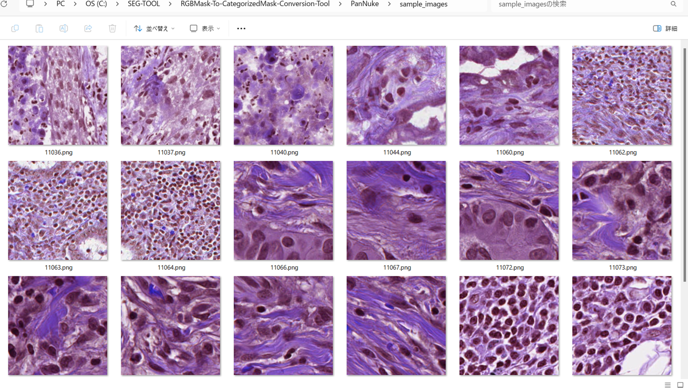
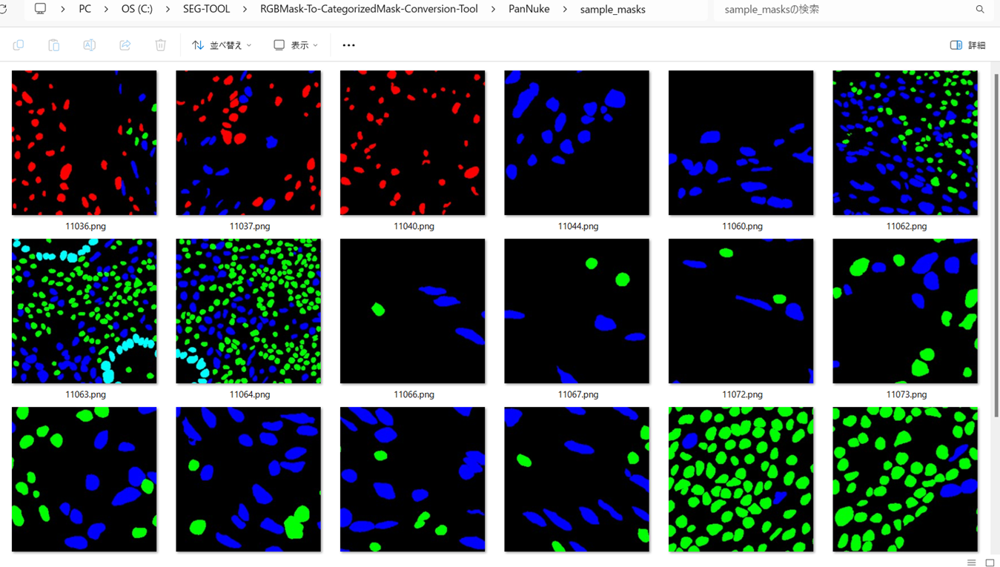
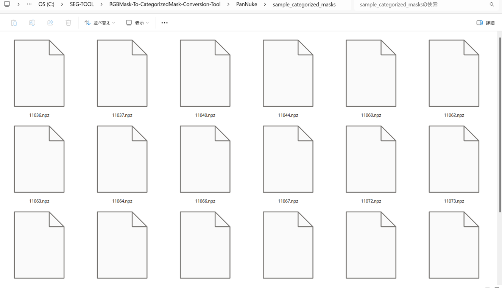

<h2>RGBMask-To-CategorizedMask-Conversion-Tool (2025/05/29)</h2>

This is an offline Python Conversion Tool to convert an RGBMask dataset to a CategorizedMask dataset 
for a Multi classes Image Segmentation . 

<h3>1. RGBMask2CategorizedMaskConverter</h3>
The <a href="./RGBMask2CategorizedMaskConverter.py">RGBMask2CategorizedMaskConverter.py</a> is a simple offline Python script
that converts an RGB-MaskDataset to a Categorized-MaskDataset.  
It is easily customizable by a configuration file <a href="./mask_categorizer.ini">mask_categorizer.ini</a> 
 

<h3>2. PanNuke ImageMaskDataset</h3>
For a simple example, we applied this conversion tool to RGBMaskDataset for 
<a href="https://github.com/sarah-antillia/ImageMask-Dataset-PanNuke">ImageMask-Dataset-PanNuke</a>. 
 
The dataset used here has been taken from. 
https://www.kaggle.com/datasets/andrewmvd/cancer-inst-segmentation-and-classification 
 
<b>About this Dataset</b> 
This dataset, also known as PanNuke, contains semi automatically generated nuclei instance segmentation and  
classification images with exhaustive nuclei labels across 19 different tissue types. The dataset consists  
of 481 visual fields, of which 312 are randomly sampled from more than 20K whole slide images at different  
magnifications, from multiple data sources. 
In total the dataset contains 205,343 labeled nuclei, each with an instance segmentation mask. Models trained  
on PanNuke can aid in whole slide image tissue type segmentation, and generalize to new tissues. 
 
More Medical Imaging Datasets 
Part 1 (current) 
Part 2 
Part 3 
More datasets 
 
<b>Acknowledgements</b> 
If you use this dataset in your research, please credit the authors: 
 
Original Publications 
@article{gamper2020pannuke, 
title={PanNuke Dataset Extension, Insights and Baselines}, 
author={Gamper, Jevgenij and Koohbanani, Navid Alemi and Graham, Simon and Jahanifar, Mostafa and Benet,  
Ksenija and Khurram, Syed Ali and Azam, Ayesha and Hewitt, Katherine and Rajpoot, Nasir}, 
journal={arXiv preprint arXiv:2003.10778}, 
year={2020}  
} 
 
@inproceedings{gamper2019pannuke, 
title={Pannuke: An open pan-cancer histology dataset for nuclei instance segmentation and classification}, 
author={Gamper, Jevgenij and Koohbanani, Navid Alemi and Benet, Ksenija and Khuram, Ali and Rajpoot, Nasir}, 
booktitle={European Congress on Digital Pathology}, 
pages={11--19}, 
year={2019}, 
organization={Springer} 
} 
 
Hovernet formated files were provided by chandlertimm with the available code here. 
 
<b>License</b>
CC BY NC SA 4.0 
 
Splash Image 
Image by Otis Brawley released as public domain by National Cancer Institute, available 
<a href="https://commons.wikimedia.org/wiki/File:Prostate_cancer_(1).jpg">here</a> 
 

<h3>3. Convert RGBMaskDataset to CategorizedMaskDataset </h3>

We need a categorized mask dataset for the training process of multi-classes Image Segemtation model.
As a preprocessing step, we generate this categorized mask dataset from the master PNG RGB mask files.
This task involves three steps: 
 
Step 1: Read the RGB mask PNG files and convert them to indexed masks. 
Step 2: Create categorized masks from the indexed masks using One-Hot encoding. 
Step 3: Save the categorized data as compressed NumPy NPZ files. 
 
Our converter RGBMask2CategorizedMaskConverter follows this steps. 
We used <b>to_categorical</b> of <b>tensorflow.keras.utils</b> as the One-Hot-Encoder. 
 
Please run the following command to convert rgb-mask files to categorize-mask files. 
<pre>
>python RGBMask2CategorizedMaskConverter.py 
</pre>
The converter reads the following <a href="./mask_categorizer.ini">mask_categorizer.ini</a> file, converts RGB_masks PNG files
in <b>rgb_masks_dir</b> to categorized_masks, and saves the categorized mask to <b>categorized_masks_dir</b> as NumPy NPZ files.

<pre>
; 2025/05/29 (C) antillia.com
; mask_categozier.ini for PanNuke sample rgb_mask

[mask_categorizer]
; Define your own rgb_map as the dict format:
;  { rgb_color_0: index_0, rgb_color_1:index_1. ...}
;             black:0,        green: 1,     red: 2 ,    blue: 3
; rgb_map  = { (0, 0, 0): 0, (0, 255, 0):1, (255,0,0):2, (0, 0, 255):3  

;PanNuke mask colors, which contains 6 classes including Background
;classes = ["Background", "Neoplastic cells", "Inflammatory", "Connective/Soft tissue cells","Dead Cells", "Epithelial"]   
;Specify rgb_map as the Python dict format
;        = { rgb_color_0:index_0, rgb_color_1:index_1,
; as shown below ,
rgb_map  = {(0, 0, 0):0, (  0, 255,   0):1,  (255,   0,   0):2,  (  0,   0, 255):3,  (255, 255,   0):4, (  0, 255, 255):5,}
color_order            = "RGB"
rgb_file_format        = ".png"
indexed_file_format    = ".png"
;Specify ".npz", which is the numpy compressed data format
categorized_file_format = ".npz"
rgb_masks_dir         = "./PanNuke/sample_masks"
indexed_masks_dir     = "./PanNuke/sample_indexed_masks"
categorized_masks_dir = "./PanNuke/sample_categorized_masks"
</pre>

 
For simplicity and demonstration purposes, we used a small sample segmentation dataset from the PanNuke Dataset. 

<b> PanNuke RGB Images</b>. 
 
 
<b>Input: PanNuke RGB Masks</b> 
 

<b>Output: NumPy NPZ</b> 
 
 

<h3>4. Revert CategorizedMaskDataset to RGBMaskDataset </h3>
You can also revert the Categorize mask dataset to the corresponding RGB mask dataset 
by using our Python script <a href="./CategorizedMask2RGBMaskReverter.py">CategorizedMask2RGBMaskReverter.py</a> 
Please run the following command to revert a Categorized-MaskDataset to an RGB-MaskDataset. 
<pre>
>python CategorizedMask2RGBMaskReverter.py
</pre>
The reverter will reads <a href="./mask_decategorizer.ini">mask_decaterozer.ini</a> configuration file. 

<pre>
; 2025/05/29 (C) antillia.com
; mask_decategozier.ini for PanNuke sample rgb_mask

[mask_categorizer]
; Define your own rgb_map as a dict
;              { rgb_color_0: index_0, rgb_color_1:index_1. ...}
;               black:0,      green: 1,      red: 2 ,    blue: 3
; rgb_map     = { (0, 0, 0): 0, (0, 255, 0):1, (255,0,0):2, (0, 0, 255):3  

;PanNuke mask colors 
;classes = ["Background", "Neoplastic cells", "Inflammatory", "Connective/Soft tissue cells","Dead Cells", "Epithelial"]   
rgb_map  = {(0, 0, 0):0, (  0, 255,   0):1,  (255,   0,   0):2,  (  0,   0, 255):3,  (255, 255,   0):4, (  0, 255, 255):5,}
color_order  = "RGB"
input_format = ".png"
;numpy compressed data format
output_format = ".npz"
;input_dir
rgb_masks_dir    = "./PanNuke/sample_masks"
;output dir
categorized_masks_dir = "./PanNuke/sample_categorized_masks/"
reverted_masks_dir    = "./PanNuke/sample_masks_reverted/"
</pre>

<b>Output: Reverted RGB Masks</b> 
 

 <h2>References</h2>
<b>1. PanNuke: An Open Pan-Cancer Histology Dataset for Nuclei Instance Segmentation and Classification</b> 
Gamper, Jevgenij and Koohbanani, Navid Alemi and Benet, Ksenija and Khuram, Ali and Rajpoot, Nasir 
<a href="https://academictorrents.com/details/99f2c7b57b95500711e33f2ee4d14c9fd7c7366c">
https://academictorrents.com/details/99f2c7b57b95500711e33f2ee4d14c9fd7c7366c</a>
 
 
<b>2. ImageMask-Dataset-PanNuke</b> 
Toshiyuki Arai @antillia.com 
<a href="https://github.com/sarah-antillia/ImageMask-Dataset-PanNuke">
https://github.com/sarah-antillia/ImageMask-Dataset-PanNuke
</a>
 
 
<b>3. RGBMask-To-GrayscaleMask-Conversion-Tool</b> 
Toshiyuki Arai @antillia.com 
<a href="https://github.com/sarah-antillia/RGBMask-To-GrayscaleMask-Conversion-Tool">https://github.com/sarah-antillia/RGBMask-To-GrayscaleMask-Conversion-Tool</a>

